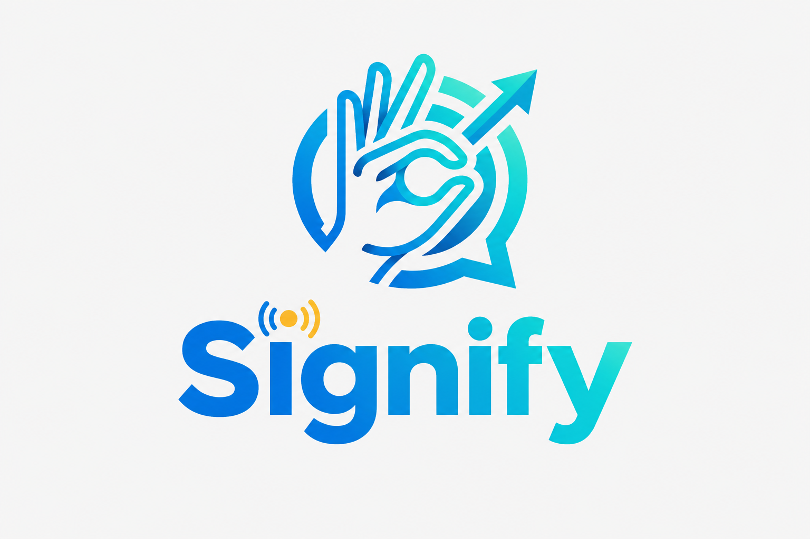

[](assets/L1.png)
# Signify

Signfy is a computer-vision pipeline that recognizes American Sign Language (ASL) hand signs in real time and converts them into text and speech. It combines a YOLO hand detector, MediaPipe landmark extraction, and a TensorFlow classifier, wrapped in a Streamlit app with live camera translation, video upload, and text-to-speech.

> **This is the `offline` branch** — a self-contained local setup meant to be cloned and run entirely on your own machine (localhost), with no deployment/hosting steps required.

## Features

- **Live Translation** — detect and translate signs from your webcam in real time, with a rolling confidence chart and adjustable stability/confidence thresholds.
- **Upload Video** — run the same pipeline over a pre-recorded video file, with pause/resume support.
- **Text to Audio** — convert any typed text to speech using ElevenLabs voices.
- **Sentence building** — recognized letters are stabilized and assembled into words/sentences, with dedicated `Space`, `Delete`, and `Clear` gestures.

## How it works

```
Camera / Video Frame
        │
        ▼
   YOLO hand detector   →  crops the hand region
        │
        ▼
  MediaPipe landmarks   →  63 (x, y, z) hand-landmark features
        │
        ▼
 TensorFlow classifier  →  predicted letter + confidence
        │
        ▼
   Prediction stabilizer →  confirms a letter only once it's stable
        │
        ▼
    Sentence builder     →  accumulates letters into words/sentences
```

## Project structure

```
Signfy/
├── app/                  # Streamlit application
│   ├── main.py           # UI: live translation, video upload, text-to-audio
│   └── backend.py        # Glue between the UI and the inference pipeline, TTS
│
├── signlens/              # Core, reusable inference package
│   ├── yolo_detector.py   # YOLO-based hand detection
│   ├── landmark.py        # MediaPipe landmark extraction + feature normalization
│   ├── recognizer.py      # TensorFlow/Keras sign classifier
│   ├── stabilizer.py      # Temporal smoothing / debouncing of predictions
│   ├── sentence.py        # Letter → word/sentence accumulation
│   └── pipeline.py        # Orchestrates the full frame → sentence pipeline
│
├── models/                 # Trained model weights and metadata
│   ├── best_50_epoch.pt      # YOLO hand-detector weights (50-epoch checkpoint)
│   ├── yolo_best_weights.pt  # YOLO hand-detector weights (active/production)
│   ├── landmark.pt           # Landmark extraction/support model
│   ├── landmark_model.keras  # Sign classifier (26 letters + Delete/Clear/Space)
│   ├── landmark_meta.json    # Legacy metadata (26-class only, kept for reference)
│   └── class_mapping.json    # Active class labels + scaler used at inference time
│
├── notebooks/               # Training notebooks
│   ├── train_yolo_best.ipynb
│   ├── train_landmark.ipynb
│   └── train_landmark_tf.ipynb
│
├── outputs/                  # Training artifacts (plots, metrics)
│   ├── confusion_matrix.png
│   ├── training_curves.png
│   ├── confidence_threshold_sweep.png
│   └── landmark_extraction_failures.csv
│
├── assets/                    # Static assets used by the app (e.g. logo)
├── requirements.txt
├── .env.example
├── LICENSE
└── README.md
```

## Getting started (Local Setup)

These steps get Signfy running on `localhost` from a clean machine — no cloud/hosting account needed.

### 1. Clone the `offline` branch

```bash
git clone -b offline https://github.com/Usf132/Signify.git
cd Signify
```

### 2. Create and activate a virtual environment

```bash
python -m venv .venv
source .venv/bin/activate      # Windows: .venv\Scripts\activate
```

### 3. Install dependencies

```bash
pip install -r requirements.txt
```

### 4. Configure your API key

Text-to-speech uses [ElevenLabs](https://elevenlabs.io/). Copy `.env.example` to `.env` and add your key:

```bash
cp .env.example .env       # Windows: copy .env.example .env
```

```
ELEVENLABS_API_KEY=your_api_key_here
```

> Live Translation, Upload Video, and Sentence building all work without this key. It's only required for the **Text to Audio** feature.

### 5. Confirm the model files are in place

Make sure `models/` contains the files listed in [Project structure](#project-structure) above — in particular `landmark_model.keras` and `class_mapping.json`, which must match each other (same number of classes). If you swap in a retrained model, update both together.

### 6. Run the app locally

```bash
streamlit run app/main.py
```

Streamlit will start a local server and print a URL — it should open automatically in your browser, or you can open it manually at:

```
http://localhost:8501
```

Grant camera access for **Live Translation**, or use **Upload Video** to translate a pre-recorded clip.

### 7. Stopping the app

Press `Ctrl+C` in the terminal running Streamlit. To fully reload code changes (not just refresh the page), stop the server and re-run step 6 — Streamlit can cache old session state otherwise.

## Model details

| Component | Model | Purpose |
|---|---|---|
| Hand detector | YOLO (`yolo_best_weights.pt`) | Locates the hand in each frame |
| Landmark extractor | MediaPipe Hands | Extracts 21 landmarks (x, y, z) per hand |
| Sign classifier | TensorFlow/Keras (`landmark_model.keras`) | Classifies normalized landmarks into a letter/command |

Class labels and the feature scaler used at inference time are stored in `models/class_mapping.json`. Training notebooks for both the YOLO detector and the landmark classifier are in `notebooks/`.

## Retraining

- `notebooks/train_yolo_best.ipynb` — trains the YOLO hand detector.
- `notebooks/train_landmark.ipynb` / `train_landmark_tf.ipynb` — trains the landmark-based sign classifier.

Training outputs (confusion matrix, training curves, confidence sweep) are saved to `outputs/`.

## Troubleshooting

- **`IndexError` on prediction** — usually means `landmark_model.keras` and `class_mapping.json` are out of sync (different number of classes). Re-check step 5 above.
- **Laggy / freezing video** — try increasing `DETECTION_INTERVAL` in `app/main.py`, lowering camera resolution, or using a smaller YOLO checkpoint.
- **Frequent misreads** — adjust the Confidence Threshold and Stability Frames sliders in the Live Translation page; make sure the hand is well-lit and centered in frame.

## Roadmap / known limitations

- Currently recognizes individual letters/commands rather than full continuous ASL sentences.
- Single-hand detection only.
- Text-to-speech requires an ElevenLabs API key and network access.

## License

Distributed under the terms of the [MIT License](LICENSE).
