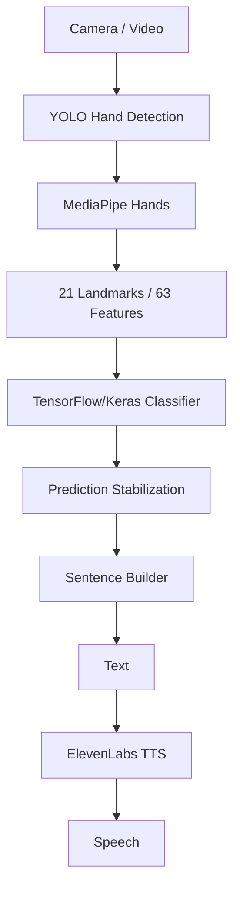
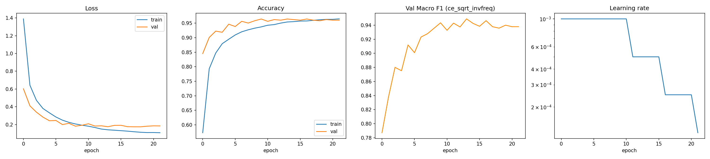
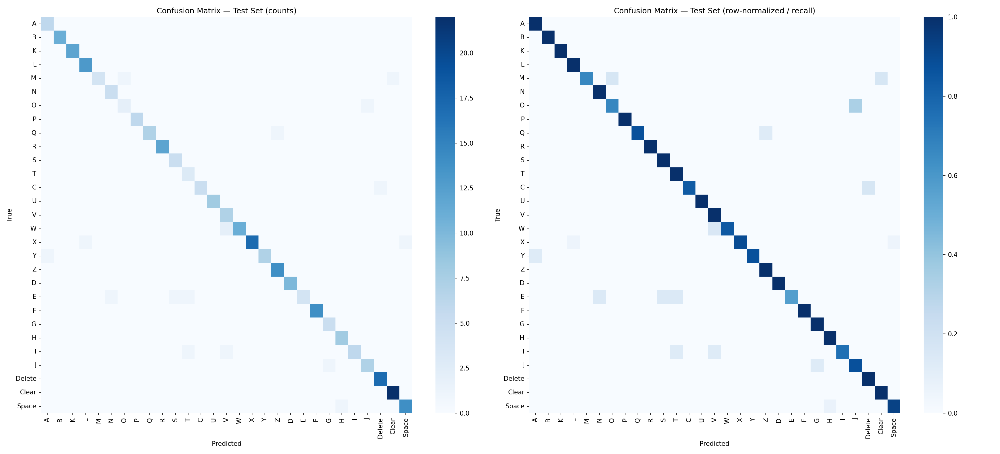
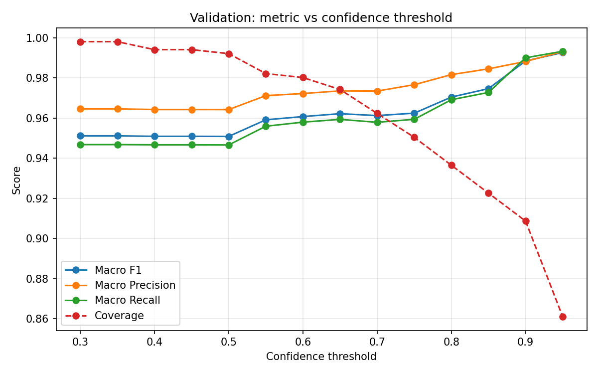

[](assets/Logo.png)

# 🤟 Signify

**Sign Language → Text → Speech.**

Signify is a real-time sign language recognition app that turns hand gestures into a spoken sentence. It didn't start out this way — the architecture below is the result of a series of experiments and pivots, which is worth understanding before diving into the code.

> We didn't abandon YOLO; we changed its job.

---

## 🧭 The Journey

**We started with YOLO.** Our first attempt treated sign recognition as direct object detection: point YOLO at a hand and have it output the letter.

**YOLO wasn't enough.** Visually similar signs kept getting confused — asking a detector to classify an entire image of a hand (background, lighting, skin tone, angle and all) was harder than it needed to be.

**We changed the representation — and the question.** Instead of classifying raw pixels, we extracted the hand's geometry: 21 landmarks per hand via MediaPipe. We didn't just change the model — we changed the question, from *"which letter is this image?"* to *"what is the geometric configuration of this hand?"* Landmarks give a compact, appearance-independent representation and reduce the classifier's dependence on how the hand actually looks in the frame.

**The model evolved.** The first landmark classifier was built in PyTorch (`landmark.pt`). It was later migrated to TensorFlow/Keras (`landmark_model.keras`), which is what the app uses today.

**YOLO came back — with a new job.** Once landmarks proved to be the better recognizer, YOLO found a new role: hand detection, cropping the region of interest before landmark extraction runs.

**The dataset fought back.** The dataset's class ordering didn't match the mapping we needed — a classifier's numeric output is meaningless without the correct index-to-letter mapping. We corrected this and now track it explicitly in `class_mapping.json` and `landmark_meta.json`.

**Letters weren't enough.** Recognizing isolated letters isn't the same as writing text, so we added three control gestures — **Space**, **Delete**, and **Clear** — to turn letter recognition into an actual text-input system.

**From predictions to sentences.** Live video predicts every frame, and single frames can be noisy. A stabilizer sits between raw predictions and the sentence builder, so a gesture is only accepted once it's stable and confident enough — not on every frame's raw guess.

**From sentences to speech.** The finished sentence is passed to **ElevenLabs** for text-to-speech, and the whole thing is wrapped in a **Streamlit** app — taking Signify from research notebooks to a usable sign → text → speech pipeline.

---

## 🏗️ Architecture



---

## ✨ Features

- **Hand detection** (YOLO) — localizes the hand before landmark extraction.
- **Landmark extraction** (MediaPipe) — 21 keypoints → 63 (x, y, z) features.
- **Sign classification** (TensorFlow/Keras) — trained on landmark geometry.
- **Control gestures** — Space, Delete, Clear, for real text composition.
- **Prediction stabilization** — filters noisy per-frame predictions before accepting a gesture.
- **Sentence builder** — maintains sentence state as gestures are accepted.
- **Text-to-speech** (ElevenLabs) — speaks the finished sentence.
- **Streamlit app** — live camera translation and video upload, with text-to-audio output.

## 🔄 How It Works

| Stage | What happens |
|---|---|
| **Input** | Camera stream or uploaded video is read frame by frame. |
| **Hand Detection** | YOLO locates and crops the hand region. |
| **Landmark Extraction** | MediaPipe extracts 21 landmarks (63 features) from the crop. |
| **Classification** | The Keras model predicts a letter or control gesture from the landmarks. |
| **Stabilization** | Predictions must be stable/confident enough before being accepted. |
| **Sentence Construction** | Accepted gestures add a character, add a space, delete, or clear. |
| **Text-to-Speech** | The built sentence is sent to ElevenLabs and spoken aloud. |

---

## 📁 Project Structure

```
Signify/
│
├── app/
│   ├── main.py                 # Streamlit application entry point
│   └── backend.py              # App backend + ElevenLabs TTS integration
│
├── signlens/
│   ├── yolo_detector.py        # YOLO hand detection
│   ├── landmark.py             # MediaPipe landmark extraction/normalization
│   ├── recognizer.py           # TensorFlow/Keras classifier
│   ├── stabilizer.py           # Prediction stabilization
│   ├── sentence.py             # Sentence construction
│   └── pipeline.py             # Orchestrates the full pipeline
│
├── models/
│   ├── landmark_model.keras            # Current classifier
│   ├── landmark.pt                     # Earlier PyTorch classifier
│   ├── landmark_meta.json              # Classifier metadata
│   ├── class_mapping.json              # Class index → letter/gesture mapping
│   └── yolo_best_weights (50 epoch).pt # YOLO hand-detector weights
│
├── notebooks/
│   ├── train_landmark.ipynb    # Landmark classifier training
│   └── train_yolo_best.ipynb   # YOLO detector training
│
├── outputs/
│   ├── confidence_threshold_sweep.png
│   ├── confusion_matrix.png
│   ├── landmark_extraction_failures.csv
│   ├── landmarks_dataset.npz
│   └── training_curves.png
│
├── assets/
│   └── logo.png
│
├── .env.example
├── requirements.txt
├── LICENSE
└── README.md
```

## 🛠️ Tech Stack

YOLO (Ultralytics) · MediaPipe Hands · PyTorch (original classifier) · TensorFlow/Keras (current classifier) · Streamlit · ElevenLabs · Python

## ⚙️ Setup

```bash
git clone https://github.com/Usf132/Signify.git
cd Signify
pip install -r requirements.txt
cp .env.example .env   # add your ElevenLabs API key
```

## ▶️ Usage

```bash
streamlit run app/main.py
```

Open the app and use live camera translation or upload a video — recognized gestures build a sentence on screen, which you can then convert to speech.

---

## 📊 Model / Evaluation

[](outputs/training_curves.png)
[](outputs/confusion_matrix.png)
[](outputs/confidence_threshold_sweep.png)

Exact accuracy/precision/recall/F1 numbers for the current Keras model aren't included yet — add them here once available rather than estimating.

## ⚠️ Limitations

- Recognition quality depends on hand visibility, lighting, and camera angle.
- Vocabulary is the alphabet plus 3 control gestures — full sign language (words, grammar, facial expression) is out of scope.
- Stabilization introduces a short, intentional delay before a gesture is accepted.
- Metrics reflect a single train/test split, not an independently vetted evaluation.

## 📚 Dataset & Acknowledgments

Dataset source: *add link once available.* Built on [Ultralytics YOLO](https://github.com/ultralytics/ultralytics), [MediaPipe Hands](https://developers.google.com/mediapipe), [TensorFlow/Keras](https://www.tensorflow.org/), and [ElevenLabs](https://elevenlabs.io/).

## 📄 License

Licensed under the [MIT License](LICENSE).

---

## 👥 Contributors

| Name | GitHub | LinkedIn |
|---|---|---|
| Beshoy Karam | [@beshoy1612](https://github.com/beshoy1612) | [beshoy-karam](https://www.linkedin.com/in/beshoy-karam) |
| Mohamed Mokhtar | [@Mo5tar2005](https://github.com/Mo5tar2005) | [mohamed-mokhtar](https://www.linkedin.com/in/mohamed-mokhtar-881347401) |
| Youssef Saad | [@Usf132](https://github.com/Usf132) | [youssef-saad-dev](https://www.linkedin.com/in/youssef-saad-dev) |
| Yusuf Mustafa | [@Draken4-4](https://github.com/Draken4-4) | [yusuf-mustafa](https://www.linkedin.com/in/yusuf-mustafa-aa7188352) |
